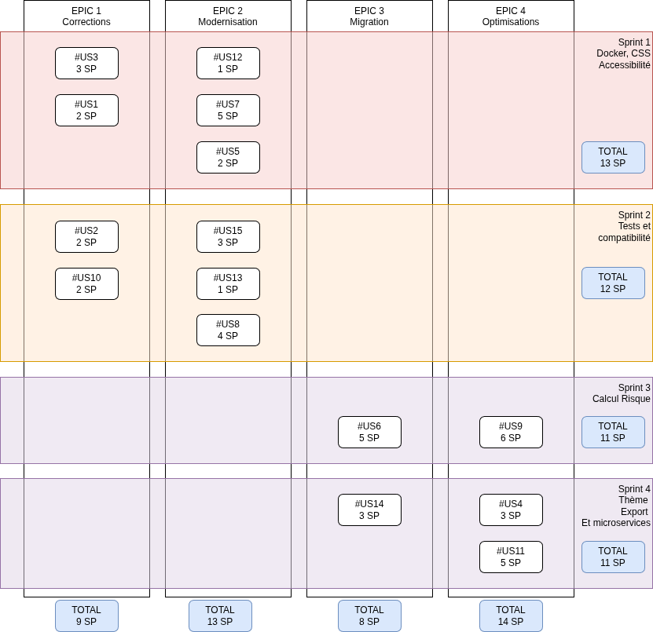

# Projet d'évolution d'application - Proposition commerciale

## Contexte

### Contexte global

Catasterre est utilisé par des notaires et agences immobilières afin d’évaluer les risques liés à la vente de biens immobiliers.

Face à l’augmentation du nombre d’utilisateurs et à l’évolution des besoins métier, l’application montre aujourd’hui ses **limites techniques et fonctionnelles**

### Fonctionnalités métiers

Catasterre permet d'accéder à des images satellites traitées pour évaluer les risques associés à des propriétés immobilières. 

Les problèmes rencontrés sont :

- UX && A11Y (accessibilité)
    - lenteurs
    - erreurs de style fréquentes et des instabilités
    - mauvaise gestion des messages d'erreur
    - mauvaise accessibilité
- Infrastructure
    - complexité croissante du code,
    - difficultés à faire évoluer l’architecture,
    - manque de visibilité sur la roadmap technique,
    - coordination perfectible entre les équipes front-end, back-end et UX.

## Réalisation du projet
<!-- 
Afin de mener à bien ce projet nous allons réaliser les étapes suivantes :

1. lister les fonctionnalités ( = epics )
    - définir les critères de validation
1. les découper en des user stories
    - estimer complexité ( planning poker )
    - définir les tests fonctionnels / critères de validation
1. estimer les risques
    - mitiger les risques si nécessaire
1. estimer les coûts
1. prioriser
    - matrice de décision
1. planifier
    - affecter 
-->

### Equipe projet

#### Membres de l'équipe

| Nom | Poste | Rôle |
| --- | --- | --- |
| Rachida | devops, dev back | référente devops |
| Dimitry | dev front | référent front |
| Jorge | UX Designer | référent a11y |
| Grégory | dev Full-Stack | SCRUM Master |

#### Tableau des compétences

| Compétence | Dimitry | Rachida | Jorge | Moyenne | Action |
| --- | --- | --- | --- | --- | --- |
| Tests auto Front | 0 | 0 | 0 | 0 | Plan de formation externe |
| Tests auto Back | 0 | 0 | 0 | 0 | Plan de formation externe |
| TDD | 0 | 3 | 0 | 1 | Plan de formation externe |
| DevOps | 0 | 5 | 0 | 1.7 | Plan de formation interne |
| Accessibilité | 3 | 0 | 5 | 2.6 | Partage de connaissance |

### Définition des tâches techniques

#### Description des épics

| Epic | Description |
| --- | --- | 
| Correction | Correction des erreurs fréquentes, amélioration de l'accessibilité |
| Modernisation | Création d'une pipeline ci/cd et tests |
| Migration | Migration vers une architecture microservice dockerisée  |
| Optimisations | Amélioration des performances sur des fonctionnalités critiques + création d'un nouveau thème |

#### Description des US (User stories)

Liste des US

| # | Nom  | Epic associée |
| --- | --- | --- |
| 1 | Amélioration du style CSS | Correction |
| 2 | Meilleure gestion des messages d’erreur | Correction |
| 3 | Améliorer l’accessibilite (A11Y) | Correction |
| 4 | Créer un nouveau theme | Optimisations |
| 5 | Encapsuler l’application | Modernisation |
| 6 | Implémentation d’une architecture en micro-services. | Migration |
| 7 | Créer une pipeline d’integration continue | Modernisation |
| 8 | Mise en place d’un environnement de test | Modernisation |
| 9 | Améliorer le calcul du risque d’inondation | Optimisations |
| 10 | Problème de compatibilite avec les navigateurs | Correction |
| 11 | Améliorer l'exportation des données | Optimisations |

#### Détails des US par Epic

Détermination de la compléxité, de la priorité et critères de validation

Ces informations sont reportés dans le [Epic board](https://github.com/users/tremran/projects/2/views/6?groupedBy%5BcolumnId%5D=406475535) sur github

##### Epic `Correction`

###### #1 Amélioration du style CSS

- lien de l'issue : https://github.com/tremran/ocr-p08-catasterre/issues/1
- Complexité : Small
- Priorité : Haute
- Critères de validation 
    - mise en place et utilisation d'un design système

###### #2 Meilleure gestion des messages d'erreurs

- lien de l'issue : https://github.com/tremran/ocr-p08-catasterre/issues/2
- Complexité : Medium
- Priorité : Haute
- Critères de validation 
    - mise en place de tests fonctionnels
    - la gestion des messages est centralisée

###### #3 Améliorer l'accessibilité (A11Y)

- lien de l'issue : https://github.com/tremran/ocr-p08-catasterre/issues/3
- Complexité : Small
- Priorité : Haute
- Critères de validation 
    - Score lighthouse accessibilité sur mobile et desktop > 95

###### #10 Problème de compatibilité avec les navigateurs

- lien de l'issue : https://github.com/tremran/ocr-p08-catasterre/issues/10
- Complexité : Small
- Priorité : Moyenne
- Critères de validation 
    - l'exécution des tests automatisés passent coté front sur les versions stables des navigateurs suivants :
        - Google Chrome
        - Firefox
        - Opéra

##### Epic `Modernisation`

###### #5 Encapsuler l'application

- lien de l'issue : https://github.com/tremran/ocr-p08-catasterre/issues/5
- Complexité : Small
- Priorité : Haute
- Critères de validation 
    - l'application s'exécute dans un container

###### #7 Créer une pipeline d'intégration continue

- lien de l'issue : https://github.com/tremran/ocr-p08-catasterre/issues/7
- Complexité : Medium
- Priorité : Haute
- Critères de validation 
    - la pipeline s'exécute sans erreurs
    - le versionning est automatisé

###### #8 Mise en place d'un environnement de test

- lien de l'issue : https://github.com/tremran/ocr-p08-catasterre/issues/8
- Complexité : Medium
- Priorité : Haute
- Critères de validation 
    - des tests automatisés s'exécutent en local

##### Epic `Migration`

###### #6 Implémentation d'une architecture en microservice

- lien de l'issue : https://github.com/tremran/ocr-p08-catasterre/issues/6
- Complexité : Extra Large
- Priorité : Moyenne
- Critères de validation 
    - l'application est composé d'au moins deux services distincts

##### Epic `Optimisations`

###### #9 Améliorer le calcul du risque d'inondation

- lien de l'issue : https://github.com/tremran/ocr-p08-catasterre/issues/9
- Complexité : Medium
- Priorité : Low
- Critères de validation 
    - le temps de calcul du risque est inférieur à 1.5 s

###### #11 Améliorer l'exportation des données

- lien de l'issue : https://github.com/tremran/ocr-p08-catasterre/issues/11
- Complexité : Medium
- Priorité : Low
- Critères de validation 
    - des tests automatisés s'exécutent en local

###### #4 Créer un nouveau thème

- lien de l'issue : https://github.com/tremran/ocr-p08-catasterre/issues/4
- Complexité : Large
- Priorité : Moyenne
- Critères de validation 
    - Score lighthouse accessibilité sur mobile et desktop > 95

### Gestion des points de complexité

Les story point prennent en compte la complexité et le volume de la tache

- temps disponible par sprint : 38 jour homme
- vélocité estimée : 15 SP
    - Dimitry : 3 SP
    - Rachida : 4 SP
    - Jorge : 4 SP
    - Grégory 4 SP

1SP ≈ 2.5 j-h
> Remarque : 3 SP pour Dimitry dans le cadre de l'aménagement de son temps de travail pour son TDAH

| Tâche technique | Complexité | Story Point | Estimation temps (jour homme) | 
| --- | --- | --- | --- |
| #1 | S | 2 | 5 |
| #2 | S | 2 | 5 |
| #3 | S | 3 | 7.5 |
| #4 | L | 3 | 7.5 |
| #5 | S | 2 | 5 |
| #6 | XL | 8 | 20 |
| #7 | M | 5 | 12.5 |
| #8 | M | 4 | 10 |
| #9 | M | 6 | 15 |
| #10 | S | 2 | 5 |
| #11 | M | 5 | 12.5 |
| **Total Complet** | - | **42** | **105** |

### Risques identifiés

- Probabilité : 
    1. Très peu probable
    2. Peu probable
    3. Possible
    4. Très probable 
    5. Avéré
- Impact :
    1. négligeable
    2. mineure
    3. modérée
    4. majeure
    5. catastrophique

Risque : 
- `< 10` : acceptable, pas de mitigation à prévoir
- `< 15` : à observer et à mitiger si une solution simple existe
- `>= 15` : à mitiger absolument

| Menace | Probabilité | Impact | Risque |
| --- | --- | --- | --- |
| Manque de testeurs qualifiés dans l'équipe | 5 | 4 | 20 |
| Porteuse unique de savoir (Devops Rachida)| 5 | 4 | 20 |
| Répartition de la charge de travail | 3 | 4 | 12 |
| Régressions fonctionnelles | 2 | 4 | 8 |
| Résistance au changement | 2 | 2 | 4 |
| Dépassement des coûts | 2 | 2 | 4 |

### Détail des risques à mitiger

#### Manque de testeurs qualifiés dans l'équipe

Probabilité : Le risque a été avéré par Rachida lors d'un daily SCRUM

Conséquence : Qualité insuffisante

Solution proposée : Plan de formation

##### Plan de formation

| id | Formation | Personnes concernés | Modalité | Remarques |
| --- | --- | --- | --- | --- |
| 12 | formation tests automatisés OCR **"Testez vos applications Front End avec JavaScript"**   formation tests fonctionnels + TDD OCR **"Automatisez des tests fonctionnels pour le web avec Cypress"** | Dimitry | 2.5j-h de formation + | A planifier au plus tôt + revue de code systématique sur tous les tests créés lors du sprint 1 |
| 13 | formation tests automatisés + TDD OCR **"Testez votre code Java pour réaliser des applications de qualité"** | Rachida | 1.5j-h de formation + | A planifier au plus tôt + revue de code systématique sur tous les tests créés lors du sprint 1 |

##### Résultats attendus

Après la formation le risque sera de 4

| Menace | Probabilité | Conséquences | Risque |
| --- | --- | --- | --- |
| Manque de testeurs qualifiés dans l'équipe | 1 | 4 | 4 |

Les User Stories ont été ajoutées au backlog dans l'epic `Modernisation`

#### Porteuse unique de savoir

Probabilité : Le risque est avéré 

Conséquence : Retard dans les développement

Solution proposée : Sessions de formations internes menés par Rachida aux membres de l'équipe

##### Plan de formation

| id | Formation | Personnes concernés | Modalité | Remarques |
| --- | --- | --- | --- | --- |
| 15 | formation DevOps | Dimitry + Jorge | Réalisé par Rachida, 2j-h de formation  | Formation mené par Rachida à planifier au plus tôt |

##### Résultats attendus

Après la formation le risque sera de 4

| Menace | Probabilité | Conséquences | Risque |
| --- | --- | --- | --- |
| Porteuse unique de savoir (Devops Rachida) | 2 | 4 | 8 |

La User Story a été ajoutée au backlog dans l'epic `Modernisation`

#### Répartition de la charge de travail

Probabilité : 3 la première ventilation des tâches semble être disproportionnée, beaucoup concernent l'UX et peu l'accessibilité et 4 tâches sont estimées à 5 SP ou plus.

Conséquence : allongement des délais de livraison

Solution proposée : 
- Quoi : découpage des taches de plus de 5 SP pour une affectation plus précise.
- Qui : equipe dev
- Quand : lors du sprint planning du sprint 2

##### Résultats attendus

Après le découpage des tâches le risque sera de 8

| Menace | Probabilité | Conséquences | Risque |
| --- | --- | --- | --- |
| Répartition de la charge de travail | 2 | 4 | 8 |

### Coûts

Les coûts seront étudiés par epics.

Une marge de **15%** est appliquée sur le coût interne (TJM) de chaque epic afin de couvrir les frais généraux, les aléas du projet et de dégager un profit.

Les TJM par personne :

- Dimitry : 300 €
- Rachida : 500 €
- Jorge : 300 €
- Grégory : 500 €

#### Coûts epic `Corrections`

| Tâche | Temps (j-h) | Membre de l’équipe | TJM (€) | Total (€) | Marge 15% (€) | Prix de vente (€) |
| --- | --- | --- | --- | --- | --- | --- |
| #1 | 5 | Dimitry + Jorge | 300 | 1 500 | 225,00 | 1 725,00 |
| #2 | 5 | Grégory + Jorge | 400 | 2 000 | 300,00 | 2 300,00 |
| #3 | 7.5 | Dimitry + Jorge | 300 | 2 250 | 337,50 | 2 587,50 |
| #10 | 5 | Dimitry | 300 | 1 500 | 225,00 | 1 725,00 |
| **Total** | **22.5** | ---  | **322** | **7 250** | **1 087,50** | **8 337,50** |

#### Coûts epic `Modernisation`

| Tâche | Temps (j-h) | Membre de l’équipe | TJM (€) | Total (€) | Marge 15% (€) | Prix de vente (€) |
| --- | --- | --- | --- | --- | --- | --- |
| #12 | 2.5 | Dimitry | 300 | 700 | 105,00 | 805,00 |
| #13 | 1.5 | Rachida  | 500 | 750 | 112,50 | 862,50 |
| #5 | 5 | Rachida | 500 | 2 500 | 375,00 | 2 875,00 |
| #7 | 12.5 | Rachida + Grégory | 500 | 6 250 | 937,50 | 7 187,50 |
| #8 | 10 | Rachida + Dimitry | 400 | 4 000 | 600,00 | 4 600,00 |
| **Total** | **31.5** | ---  | **450** | **14 200** | **2 130,00** | **16 330,00** |

#### Coûts epic `Migration`

> Nécessite l'epic `Modernisation`

| Tâche | Temps (j-h) | Membre de l’équipe | TJM (€) | Total (€) | Marge 15% (€) | Prix de vente (€) |
| --- | --- | --- | --- | --- | --- | --- |
| #6 | 20 | Rachida + Grégory | 500 | 10 000 | 1 500,00 | 11 500,00 |
| **Total** | **20** | ---  | **500** | **10 000** | **1 500,00** | **11 500,00** |

#### Coûts epic `Optimisations`

| Tâche | Temps (j-h) | Membre de l’équipe | TJM (€) | Total (€) | Marge 15% (€) | Prix de vente (€) |
| --- | --- | --- | --- | --- | --- | --- |
| #4 | 7.5 | Dimitry + Jorge | 300 | 2 250 | 337,50 | 2 587,50 |
| #9 | 15 | Grégory | 500 | 7 500 | 1 125,00 | 8 625,00 |
| #11 | 12.5 | Rachida + Grégory | 500 | 6 250 | 937,50 | 7 187,50 |
| **Total** | **35** | ---  | **425** | **16 000** | **2 400,00** | **18 400,00** |

#### Résumé des coûts par epic

| Epic | Temps (j-h) | TJM (€) | Total (€) | Marge 15% (€) | Prix de vente (€) |
| --- | --- | --- | --- | --- | --- |
| Corrections   | 22.5  | 322 | 7 250  | 1 087,50 | 8 337,50  |
| Modernisation | 31.5  | 450 | 14 200 | 2 130,00 | 16 330,00 |
| Migration     | 20    | 500 | 10 000 | 1 500,00 | 11 500,00 |
| Optimisations | 35    | 425 | 16 000 | 2 400,00 | 18 400,00 |
| **Total**     | **109** | **435** | **47 450** | **7 117,50** | **54 567,50** |

> L'epic `Migration` nécessite l'epic `Modernisation`

### Propositions

| Proposition | Contenu | Coût interne (€) | Prix de vente (€) | Durée |
| --- | --- | --- | --- | --- |
| Proposition 1 | epics `Corrections` et `Modernisation` | 21 450 | 24 667,50 | 4 semaines |
| Proposition 2 | Proposition 1 +  `Migration` et `Optimisations` | 47 450 | 54 567,50 | 8 semaines |

#### Planification

### Définition des objectifs de performance

<!-- Ajouter ici des objectifs de performance pour montrer la faisabilité quantifiable de la solution. Il est également possible d’ajouter cette section dans la troisième partie. -->
Périodiquement, les objectifs de performance suivants seront évalués

| Type | nom | objectif | périodicité | bloquant
| --- | --- | --- | --- | --- |
| accessibilité | Score accessibilité lighthouse | > 90 | a chaque merge | non |
| Stabilité | Change failure rate | < 25% | fin de sprint | non |
| Stabilité | Failed Deployment Recovery Time (ancien MTTR) | < 1j | fin de sprint | non |
| Qualité | taux de couverture des tests automatisés | > 80% | a chaque merge | non |
| Non regression | réussite de la suite de tests automatisés | réussite | a chaque merge | oui |

## Impact environnemental

L'architecture microservices augmente le nombre de serveurs et leurs consommation par rapport à l'existant.

La conteneurisation génère des images qui peuvent être volumineuses.

Les actions suivantes sont proposées afin de réduire cet impact

| action |  effet |
| --- | --- |
| Utilisation des build multistages de Docker | réduction de la taille des images de plus de 50% |
| Mettre en place l'auto scaling avec le service d'orchestration choisi ( intégré à K8s, ou manuellement avec docker swarm ) | augmentation des services utilisés uniquement lorsque cela est nécessaire |

## Synthèse

2 propositions ont été étudiées. 
4 sprints sont prévus  :

### Proposition périmètre réduit

La version light comprends les epics `Corrections` et `Modernisation`

Le coût est estimé à 24 667,50€ en 4 semaines.

### Proposition périmètre complet

La version complète ajoute les epics `Migration` et `Optimisations` pour une estimation de 54 567,50€ en 8 semaines.

