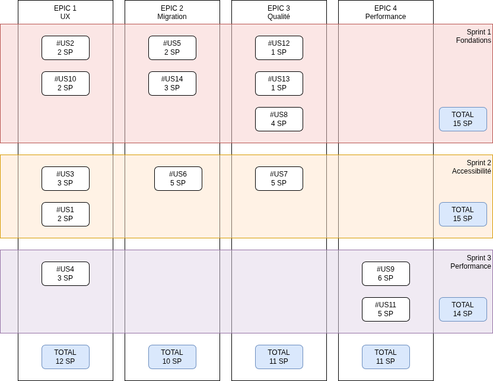

# Projet d'évolution d'application - Proposition commerciale

## Contexte

### Contexte global

Catasterre est utilisé par des notaires et agences immobilières afin d’évaluer les risques liés à la vente de biens immobiliers.

Face à l’augmentation du nombre d’utilisateurs et à l’évolution des besoins métier, l’application montre aujourd’hui ses **limites techniques et fonctionnelles**

### Fonctionnalités métiers

Catasterre permet d'accéder à des images satellites traitées pour évaluer les risques associés à des propriétés immobilières. 

Les problèmes rencontrés sont :

- UX && A11Y
    - lenteurs
    - erreurs de style fréquentes et des instabilités
    - mauvaise gestion des messages d'erreur
    - mauvaise accessibilité
- Infrastructure
    - complexité croissante du code,
    - difficultés à faire évoluer l’architecture,
    - manque de visibilité sur la roadmap technique,
    - coordination perfectible entre les équipes front-end, back-end et UX.

## Réalisation du projet

Afin de mener à bien ce projet nous allons réaliser les étapes suivantes :

1. lister les fonctionnalités ( = epics )
    - définir les critères de validation
1. les découper en des user stories
    - estimer complexité ( planning poker )
    - définir les tests fonctionnels / critères de validation
1. estimer les risques
    - mitiger les risques si nécessaire
1. estimer les coûts
1. prioriser
    - matrice de décision
1. planifier
    - affecter

### Equipe projet

#### 
<!-- Reprendre ici les différentes étapes pour mener à bien le projet. Définir ensuite le système d'affectation des points de complexité, les coûts justifiés et les risques détaillés -->

### Définition des tâches techniques

#### Description des épics

| Epic | Description |
| --- | --- | 
| UX - Amélioration interface utilisateur | Correction des erreurs fréquentes, amélioration de l'UX |
| Migration - Garantir la disponibilité et améliorer la maintenabilité et l'évolutivité | Migration vers une architecture microservice dockerisée  |
| Qualité - Fiabiliser l’organisation du développement | Création d'une pipeline CI et ajout de tests automatisés |
| Performance - Amélioration des performances | Amélioration des performances sur des fonctionnalités critiques |

#### Description des US

Liste des US

| # | Nom  | Epic associée |
| --- | --- | --- |
| 1 | Amélioration du style CSS | UX |
| 2 | Meilleure gestion des messages d’erreur | UX |
| 3 | Améliorer l’accessibilite (A11Y) | UX |
| 4 | Créer un nouveau theme | UX |
| 5 | Encapsuler l’application | Migration |
| 6 | Implémentation d’une architecture en micro-services. | Migration |
| 7 | Créer une pipeline d’integration continue | Qualité |
| 8 | Mise en place d’un environnement de test | Qualité |
| 9 | Améliorer le calcul du risque d’inondation | Performance |
| 10 | Problème de compatibilite avec les navigateurs | UX |
| 11 | Améliorer l'exportation des données | Performance |

#### Détails des US par Epic

Détermination de la compléxité, de la priorité et critères de validation

Ces informations sont reportés dans le [Epic board](https://github.com/users/tremran/projects/2/views/6?groupedBy%5BcolumnId%5D=406475535) sur github

##### Epic `UX`

###### #1 Amélioration du style CSS

- lien de l'issue : https://github.com/tremran/ocr-p08-catasterre/issues/1
- Complexité : Small
- Priorité : Haute
- Critères de validation 
    - mise en place et utilisation d'un design système

###### #2 Meilleure gestion des messages d'erreurs

- lien de l'issue : https://github.com/tremran/ocr-p08-catasterre/issues/2
- Complexité : Medium
- Priorité : Haute
- Critères de validation 
    - mise en place de tests fonctionnels
    - la gestion des messages est centralisée

###### #3 Améliorer l'accessibilité (A11Y)

- lien de l'issue : https://github.com/tremran/ocr-p08-catasterre/issues/3
- Complexité : Small
- Priorité : Haute
- Critères de validation 
    - Score lighthouse accessibilité sur mobile et desktop > 95

###### #4 Créer un nouveau thème

- lien de l'issue : https://github.com/tremran/ocr-p08-catasterre/issues/4
- Complexité : Large
- Priorité : Moyenne
- Critères de validation 
    - Score lighthouse accessibilité sur mobile et desktop > 95

###### #10 Problème de compatibilité avec les navigateurs

- lien de l'issue : https://github.com/tremran/ocr-p08-catasterre/issues/10
- Complexité : Small
- Priorité : Moyenne
- Critères de validation 
    - l'exécution des tests automatisés passent coté front sur les versions stables des navigateurs suivants :
        - Google Chrome
        - Firefox
        - Opéra

##### Epic `Migration`

###### #5 Encapsuler l'application

- lien de l'issue : https://github.com/tremran/ocr-p08-catasterre/issues/5
- Complexité : Small
- Priorité : Haute
- Critères de validation 
    - l'application s'exécute dans un container

###### #6 Implémentation d'une architecture en microservice

- lien de l'issue : https://github.com/tremran/ocr-p08-catasterre/issues/6
- Complexité : Extra Large
- Priorité : Moyenne
- Critères de validation 
    - l'application est composé d'au moins deux services distincts

##### Epic `Qualité`

###### #7 Créer une pipeline d'intégration continue

- lien de l'issue : https://github.com/tremran/ocr-p08-catasterre/issues/7
- Complexité : Medium
- Priorité : Haute
- Critères de validation 
    - la pipeline s'exécute sans erreurs
    - le versionning est automatisé

###### #8 Mise en place d'un environnement de test

- lien de l'issue : https://github.com/tremran/ocr-p08-catasterre/issues/8
- Complexité : Medium
- Priorité : Haute
- Critères de validation 
    - des tests automatisés s'exécutent en local

##### Epic `Performance`

###### #9 Améliorer le calcul du risque d'inondation

- lien de l'issue : https://github.com/tremran/ocr-p08-catasterre/issues/9
- Complexité : Medium
- Priorité : Low
- Critères de validation 
    - le temps de calcul du risque est inférieur à 1.5 s

###### #11 Améliorer l'exportation des données

- lien de l'issue : https://github.com/tremran/ocr-p08-catasterre/issues/11
- Complexité : Medium
- Priorité : Low
- Critères de validation 
    - des tests automatisés s'exécutent en local

### Gestion des points de complexité

Les story point prennent en compte la complexité et le volume de la tache

temps disponible par sprint : 38 jour homme
vélocité estimée : 15 SP
    - Dimitry : 3 SP
    - Rachida : 4 SP
    - Jorge : 4 SP
    - Grégory 4 SP
1SP ≈ 2.5 j-h
> Remarque : 3 SP pour Dimitry dans le cadre de l'aménagement de son temps de travail pour son TDAH

| Tâche technique | Complexité | Story Point | Estimation temps (jour homme) | 
| --- | --- | --- | --- |
| #1 | S | 2 | 5 |
| #2 | S | 2 | 5 |
| #3 | S | 3 | 7.5 |
| #10 | S | 2 | 5 |
| #5 | S | 2 | 5 |
| #6 | XL | 8 | 20 |
| #7 | M | 5 | 12.5 |
| #8 | M | 4 | 10 |
| **Total Light** | - | **28** | **70** |
| #4 | L | 3 | 7.5 |
| #9 | M | 6 | 15 |
| #11 | M | 5 | 12.5 |
| **Total Complet** | - | **42** | **105** |

### Risques identifiés

- probabilité : 
    1. Très peu probable
    2. Peu probable
    3. Possible
    4. Très probable 
    5. Avéré
- conséquence :
    1. négligeable
    2. mineure
    3. modérée
    4. majeure
    5. catastrophique

Risque : 
- `< 10` : acceptable, pas de mitigation à prévoir
- `< 15` : à observer et à mitiger si une solution simple existe
- `>= 16` : à mitiger absolument

| Libellé | Probabilité | Conséquences | Risque |
| --- | --- | --- | --- |
| Manque de testeurs qualifiés dans l'équipe | 5 | 4 | 20 |
| Répartition de la charge de travail | 3 | 4 | 12 |
| Régressions fonctionnelles | 2 | 4 | 8 |
| Résistance au changement | 2 | 2 | 4 |
| Dépassement des coûts | 2 | 2 | 4 |

### Détail des risques à mitiger

#### Manque de testeurs qualifiés dans l'équipe

Probabilité : Le risque a été avéré par Rachida lors d'un daily SCRUM

Conséquence : Qualité insuffisante

Solution proposée : Plan de formation

##### Plan de formation

| id | Formation | Personnes concernés | Modalité | Remarques |
| --- | --- | --- | --- | --- |
| 12 | formation tests automatisés OCR **"Testez vos applications Front End avec JavaScript"**   formation tests fonctionnels + TDD OCR **"Automatisez des tests fonctionnels pour le web avec Cypress"** | Dimitry | 2.5j-h de formation + | A planifier au plus tôt + revue de code systématique sur tous les tests créés lors du sprint 1 |
| 13 | formation tests automatisés + TDD OCR **"Testez votre code Java pour réaliser des applications de qualité"** | Rachida | 1.5j-h de formation + | A planifier au plus tôt + revue de code systématique sur tous les tests créés lors du sprint 1 |

##### Résultats attendus

Après la formation le risque sera de 4

| Libellé | Probabilité | Conséquences | Risque |
| --- | --- | --- | --- |
| Manque de testeurs qualifiés dans l'équipe | 1 | 4 | 4 |

Les User Stories ont été ajoutées au backlog

#### Répartition de la charge de travail

Probabilité : 3 la première ventilation des taches semble etre disproportionné, beaucoup concernent l'UX et peu l'accessibilité

Conséquence : allongement des délais de livraison

Solution proposée : 
- Quoi : découpage des taches de plus de 5 SP pour une affectation plus précise.
- Qui : equipe dev
- Quand : lors du sprint planning du sprint 2

##### Résultats attendus

Après le découpage des tâches le risque sera de 8

| Libellé | Probabilité | Conséquences | Risque |
| --- | --- | --- | --- |
| Répartition de la charge de travail | 2 | 4 | 8 |

### Coûts

<!-- Servez-vous de la description de l’équipe dans le cahier des charges pour déterminer la charge de travail à prévoir pour chaque tâche, afin de pouvoir en déduire les coûts. Détaillez vos calculs dans cet espace, puis complétez le tableau avec vos conclusions. -->
Les TJM par personne :

- Dimitry : 300 €
- Rachida : 500 €
- Jorge : 300 €
- Grégory : 500 €

Version light sans les US 4, 9 et 11

| Tâche | Temps (j-h) | Membre de l’équipe | TJM (€) | Total (€)| 
| --- | --- | --- | --- | --- | 
| #1 | 5 | Dimitry + Jorge | 300 | 1 500 | 
| #2 | 5 | Grégory + Jorge | 400 | 2 000 | 
| #3 | 7.5 | Dimitry + Jorge | 300 | 2 250 | 
| #10 | 5 | Dimitry | 300 | 1 500 | 
| #5 | 5 | Rachida | 500 | 2 500 | 
| #6 | 20 | Rachida + Grégory | 500 | 10 000 | 
| #7 | 12.5 | Rachida + Grégory | 500 | 6 250 | 
| #8 | 10 | Rachida + Dimitry | 400 | 4 000 | 
| #12 | 2.5 | Dimitry | 300 | 700 |
| #13 | 1.5 | Rachida  | 500 | 750 |
| **Total light** | **74** | ---  | **425** | **31 450** |
| #4 | 7.5 | Dimitry + Jorge | 300 | 2 250 |
| #9 | 15 | Grégory | 500 | 7 500 |
| #11 | 12.5 | Rachida + Grégory | 500 | 6 250 |
| **Total** | **109** | ---  | **425** | **47450** |

### Définition des objectifs de performance

<!-- Ajouter ici des objectifs de performance pour montrer la faisabilité quantifiable de la solution. Il est également possible d’ajouter cette section dans la troisième partie. -->
Périodiquement, les objectifs de performance suivants seront évalués

| Type | nom | objectif | périodicité | bloquant
| --- | --- | --- | --- | --- |
| accessibilité | Score accessibilité lighthouse | > 90 | a chaque merge | non |
| Stabilité | Change failure rate | < 25% | fin de sprint | non |
| Stabilité | Failed Deployment Recovery Time (ancien MTTR) | < 1j | fin de sprint | non |
| Qualité | taux de couverture des tests automatisés | > 80% | a chaque merge | oui |

## Planification

Planification par epic, priorité et dépendances des US

## Synthèse

2 propositions ont été étudiées. 
3 sprints sont prévus :

- Sprint 1 : Fondation
    - Epic `UX`
        - US2 - Meilleure gestion des messages d'erreurs 
        - US10 - Problème de compatibilité avec les navigateurs
    - Epic `Migration`
        - US5 - Encapsuler l'application
        - US14 - Implémentation d'une architecture en microservice - partie 1
    - Epic `Qualité`
        - US12 - Formation tests automatisés Front
        - US13 - Formation tests automatisés Back
        - US8 - Mise en place d'un environnement de test
- Sprint 2 : Accessibilité
    - Epic `UX`
        - US1 - Amélioration du style CSS
        - US3 - Améliorer l'accessibilité
    - Epic `Migration`
        - US6 - Implémentation d'une architecture en microservice - partie 2
    - Epic `Qualité`
        - US7 - Créer une pipeline d'intégration continue
- Sprint 3 : Performance
    - Epic `UX`
        - US4 - Créer un nouveau thème
    - Epic `Performance`
        - US9 - Améliorer le calcul du risque d'inondation
        - US11 - Améliorer l'exportaion des données

### Version light

La version light comprends les sprint 1 `Fondation` et 2 `Accessibilité`

Le coût est estimé à 31 450€ en 4 semaines.

### Version complète

La version complète ajoute le sprint 3 pour une estimation de 47 450€ en 6 semaines.

