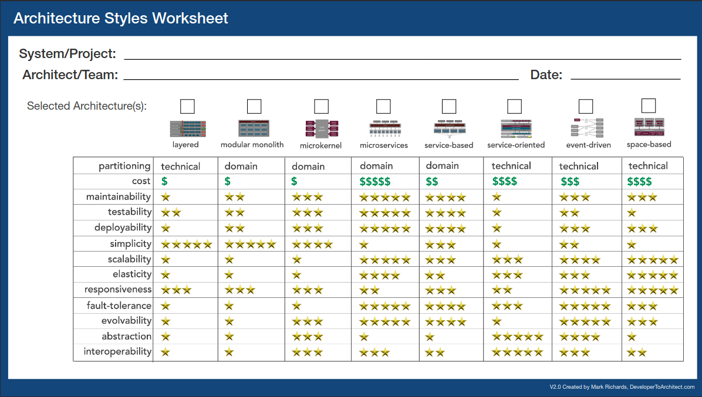

# Veille technologique

## Moteur de conteneurisation

Le cahier des charges indique qu'il faut "encapsuler l'application dans un container docker afin de "garantir la disponibilité et améliorer la maintenabilité et l'évolutivité

voir [ADR0001 Choix du moteur de conteneurisation](./docs/adr/0001-choix-techno-pour-conteneuriser.md) correspondante.

### Résumé Docker

Docker est le standard pour conteneuriser un logiciel.

Les dockerfile multistage permettent de:
- augmenter la sécurité en diminuant la surface d'attaque des containers
- diminuer la taille de l'image généré

Docker compose permet d'avoir un environnement homogène peu importe l'environnement dans lequel s'exécute l'application

Docker swarm permettra d'orchestrer les containers afin d'augmenter la disponibilité et / ou les performances de l'application

## Pipeline CI / CD

Le cahier des charges indique qu'il faut mettre en place une pipeline d'intégration continue afin de "fiabiliser l'organisation du développement"

voir [ADR0002 Choix de la plateforme CI/CD](./docs/adr/0002-choix-plateforme-pour-pipeline-ci.md) correspondante.

Github actions nous permettra d'automatiser :
- l'exécution des tests automatisés
- d'analyser le qualité du code
- de faire le suivi de version
- de générer les images

## Architecture micro services

> [source developertoarchitect.com](https://www.developertoarchitect.com/downloads/architecture-styles-worksheet.pdf) 

L'architecture micro service permet de diviser l'application en composants complètement indépendants.
Cela permet de :
- faire évoluer chaque partie de l'application de manière indépendante
- dimensionner chaque service selon la charge effective ( plusieurs replicas pour les services très utilisés ) = scaling ou mise à l'échelle
- redonder les services critiques pour améliorer leurs disponibilité

Le plus gros inconvénient est la complexité que l'architecture apporte notamment pour gérer 
- la communication entre les services
- le suivi et l'identification des erreurs

